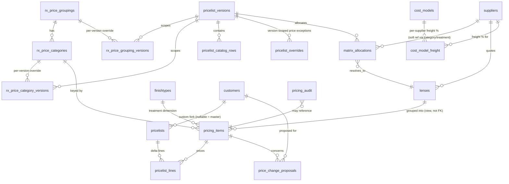

# Pricing Schema — Target Model (BS1-01)

Audit of every existing pricing-related table, decisions on keep/extend/deprecate, and the
target schema for the master→customer-fork pricing model (`docs/CUSTOMER_EXPERIENCE_PLAN.md`).
Every entity name below is locked for BS1-02 through BS1-08 — do not introduce a differently
named table for the same concept.

## Two separate domains — do not conflate

The audit surfaced two pre-existing, parallel systems that both touch "pricing" but serve
different purposes. The new master/fork model belongs to the **first** one only.

1. **Rx lens pricing** (`price_matrix`, `pricelist_versions`, `pricelist_overrides`,
   `pricelist_catalog_rows`, `matrix_allocations`, `rx_price_groupings/categories`) — the
   operator's internal wholesale price-list *authoring/editing* tool. Produces printable/PDF
   catalogs and BBD price grids for custom lab-order lenses. This is what BS1-02..BS1-08 extend.
2. **Store variant engine** (`store_product_variants`, `store_product_variant_settings`,
   20260331 migration) — sellable SKU/stock variants for the public web store cart/checkout
   (physical inventory: frames, supplies, addons). Unrelated to the fork model. Out of scope.

`price_catalog` (Phase 2 CRM foundation, 20260226) is a third, denormalized thing again —
a publisher snapshot for the public site (`web_enabled`/`wspl_enabled` flags), fed by
`source_item_id` from `lenses`/`supplies`/`addons`. Also out of scope for BS1.

## Existing tables — audit findings and decisions

| Table | Created | Decision | Why |
|---|---|---|---|
| `price_matrix` | pre-migration (undocumented, RLS added 20260219) | **Keep as-is** | Flat category×index wholesale grid. Feeds the catalog editor. Not customer-specific — stays the shared cost/price basis one layer below `pricelist_versions`. |
| `pricelist_versions` | pre-migration (RLS 20260219) | **Keep as-is; do not reuse for customer forking** | This is versioning of the *catalog structure/document* (which rows, sections, layout render into a PDF/price list), gated by `is_template`/`master_discount_percent`/`master_markup_percent`. That "master" is a different axis from a *customer's* master vs custom prices. Reusing it for BS1-04 would break the catalog editor's existing clone/template flow. |
| `pricelist_overrides` | pre-migration (RLS 20260219) | **Keep as-is; not the fork mechanism** | Version-scoped price exceptions on `price_matrix` cells (category + index_column), shared by every customer assigned to that `pricelist_version`. Per-customer deltas need a new table (`pricelist_lines`, below) — conflating the two would make one customer's price-match silently change every other customer on the same version. |
| `pricelist_catalog_rows` | `20260220114207` | **Keep as-is** | Per-version row layout for PDF/catalog rendering. `row_key` already encodes `matrix::<group_key>::<category_key>::<material>` — this composite key is the pattern the new `pricing_items` natural key (below) follows. |
| `matrix_allocations` | pre-migration (RLS 20260220) | **Keep as-is** | Resolves a category×material×treatment cell to one concrete `lens_id` per pricelist version, with its allocated BBD price. `category`/`treatment_type` are soft string references to `rx_price_categories.key`/`rx_price_groupings.key` (no FK) — leave as-is, don't tighten in this round. |
| `rx_price_groupings` / `rx_price_categories` (+ `_versions`) | `20260321090000` | **Keep; this is the shared taxonomy new tables key off** | Already implements a "master definition + per-version override" pattern (base table + `*_versions` override table). `cost_models` and fork lines reference this taxonomy via the new `pricing_items` table below, not directly. |
| `price_catalog` | `20260226190000` | **Keep, unrelated** | Public-site publisher snapshot, not part of the fork model. |
| `suppliers` | `20260212114711` | **Extend (FK target only, no column changes)** | Thin (`id, name, is_active`). Already `lenses.supplier_id`'s FK target — no new consumer needed; see correction below on why costs live on `lenses`, not a new supplier-cost table. |
| `customers` | pre-migration (not in migration history) | **Extend — FK target for `pricelists.customer_id`; `assigned_pricelist_id` phased out** | Real production table: `id integer PK, contact_id → contacts.id, account_number, innovations_customer_id, assigned_pricelist_id → pricelist_versions.id, credit_limit, pay_by_eft/card, ...`. `assigned_pricelist_id` is TODAY's customer-pricing mechanism — see reconciliation section below. |
| `product_cost` (RPC/audit, not a table) | `20260713150000` | **Keep; extend the pattern** | `get_lenses_safe()`/`get_supplies_safe()`/`get_addons_safe()` mask cost columns from non-editors; `audit_product_cost_rls()` regression-checks that masking. BS1-08's `pricing_audit` table follows this same "protect + verify" pattern for the new cost/price tables. |

### Resolved ambiguities (per BS1-01 task list)

- **Is `pricelist_versions` the lineage mechanism for the MASTER, or is a new `pricelists`
  table needed?** → New table needed: `pricelists` (customer master/fork assignment). See below.
- **Do `pricelist_overrides` become the per-customer fork line-items, or are they
  version-scoped edits?** → Version-scoped edits, unchanged. New `pricelist_lines` table holds
  per-customer fork deltas.
- **Relationship between `price_matrix`, `pricelist_catalog_rows`, and the unified variant
  engine (20260331)?** → No relationship. The unified variant engine (`store_product_variants`
  et al.) is the web-store stock/SKU system; `price_matrix`/`pricelist_catalog_rows` are the
  Rx lens catalog-authoring system. They share no tables and must not be merged.

## Reconciliation with the existing `assigned_pricelist_id` mechanism (resolved 2026-07-15)

**Finding:** `customers.assigned_pricelist_id → pricelist_versions.id` is already live in production —
admin assigns it (`WebsitePortalsPage.tsx`'s `assignPricelist` mutation), the portal reads it
(`usePortalIdentity.ts`, `AssignedPricelistsSection.tsx`). The operational pattern behind it,
confirmed by `saved-pricelists.json` (customer-named entries like `"OBL - (Safety Supply Co) –
Jun 2026"`), is: staff **clone a whole `pricelist_versions` document per customer** and edit
prices into it via `pricelist_overrides`. This is a real, working fork mechanism today — just a
coarse one (whole-document clone to change a single price).

Left alone, BS1-04's new `pricelists`/`pricelist_lines` tables would become a *second*,
parallel customer→price mechanism running alongside this one — two sources of truth for "what
does this customer pay," which is exactly the fragmentation the CRM/one-cockpit rules elsewhere
in this project exist to prevent.

**Decision (operator-confirmed 2026-07-15): catalog layout is identical for every customer —
only prices vary.** Therefore:

- **Collapse to one canonical `pricelist_versions` row** as the single shared catalog
  structure/layout for everyone (rows, sections, PDF rendering) — no more per-customer document
  clones. Picking/creating that canonical row is a BS1-04 prerequisite task (below).
- **`pricelists`/`pricelist_lines` become the sole customer-pricing mechanism** going forward.
  `effective_price(customer_id, item_ref)` is the only read path portal/Rx-form code should call.
- **`customers.assigned_pricelist_id` is phased out, not dropped immediately:**
  1. BS1-04 adds the new tables; `assigned_pricelist_id` keeps working untouched (no regression risk).
  2. BS1-08's cutover step diffs each customer's currently-cloned version against the new
     canonical master, seeding `pricelist_lines` only where prices actually differ (sparse, as
     designed) — this is the reconciliation script, added to BS1-08's task list.
  3. Once the sample-parity report (BS1-08 acceptance) confirms the new resolution path matches
     the old clones to the cent, `WebsitePortalsPage.tsx`/`AssignedPricelistsSection.tsx` are
     repointed to `pricelists`/`effective_price()` and `assigned_pricelist_id` is left in place
     but unused (dropped in a later, separate cleanup migration — not part of BS1).
- **`customers.id` is `integer`, not `uuid`** — `pricelists.customer_id integer REFERENCES customers(id)`, correcting the earlier placeholder.

## Correction (2026-07-15): supplier costs already live on `lenses` — do not duplicate

Original BS1-02 draft assumed supplier costs needed importing from
`pricelist-automation/lens-data.json` into a new hand-fed table. **That's backwards.** The
operator confirmed pricelist-automation's cost data is itself drawn FROM the website's lens
catalog — `lens-data.json` is a downstream export of `lenses`, not an independent source.

`lenses` (schema: `id uuid, supplier_id → suppliers.id, base_price numeric (cost), sell_price,
pricing_category text, pricing_index text, index_value numeric, finishtype_id → finishtypes.id
(the treatment dimension: clear/transitions/photochromic/polarized/bluefilter — a table I missed
entirely in the first BS1-01 pass), lenstype_id, material_id, mftype_id, is_active, ...`) already
stores **one row per supplier's quote for one exact lens spec**. Multiple `lenses` rows already
share the same (pricing_category, pricing_index, finishtype_id, lenstype_id, material_id,
mftype_id) combo, differing only in `supplier_id`/`base_price`/`sell_price` — confirmed live by
the existing `/admin/pricing/compare` tool (`docs/pricing-supplier-compare-operation.md`), which
lets operators pick candidate lens rows and diff cost/sell/markup across them, and by
`matrix_allocations.lens_id`, which already resolves a combo to its *preferred* supplier's row —
implying sibling rows for the same combo, different suppliers, already exist to choose from.

**Consequence for BS1-02:** no new `supplier_item_costs` table fed by a JSON importer. Instead:
- Per-item exclusion (locked decision: per-item, not whole-supplier) becomes `ALTER TABLE lenses
  ADD COLUMN excluded_from_anchor boolean DEFAULT false, excluded_reason text, excluded_by uuid,
  excluded_at timestamptz` — since one `lenses` row already IS one supplier's cost for one item,
  no join table is needed at all.
- A view (not a table) groups `lenses` by combo to feed the anchor/floor engine (BS1-05) —
  see `pricing_items` below.
- `pricelist-automation/lens-data.json` stops being an import source for BS1-08; it becomes, at
  most, a gap-check (flag any supplier quote present in the JSON but absent from `lenses` for
  manual catalog entry — never silently written into a shadow table).

## `pricing_items` combo key — RESOLVED (2026-07-15, later same day)

The deferral below turned out to be the right call: the combo key isn't derivable from any
combination of `lenses` FK columns at all. It's `C:\DEV\pricelist-automation\lens-classifier.js`'s
`${treatment}||${tier}||${material}`, where each piece comes from **parsing `lenses.name` text**
(`normMaterial`, `normTreatment`) plus a **hand-curated `TIER_MAP`** keyed on
`${mftype.name}|${lenstype.name}` encoding which specific product design belongs at which
quality tier (e.g. "Progressive|Endless Steady" → "Progressive - Best" vs.
"Progressive|Physio" → "Progressive - Adept") — business knowledge with no structural
representation in the schema, including inline `// FLAG:` notes on ambiguous cases the operator
had already caught by hand. No amount of grouping `lenses` FK columns was ever going to surface
this. Full plan to port it: `docs/issues/BS1-05-pricing-computation-service.md`.

## `pricing_items` — DEFERRED to BS1-05, not built in BS1-02 (2026-07-15) — superseded above

BS1-02 shipped (see `20260715120000_lens_anchor_exclusion_and_pricing_audit.sql`:
`lenses.excluded_from_anchor/excluded_reason/excluded_by/excluded_at` +
`toggle_anchor_exclusion()` RPC + `pricing_audit` table). It does not depend on how `lenses`
rows group into combos, so it's done and correct regardless of what follows here.

The combo-grouping table/view (originally BS1-02 task 4, `pricing_item_supplier_costs`) is
**deferred to BS1-05**, where the actual anchor/floor logic gets built. Two guesses at the
combo key were checked against live data and both failed:

1. **`(pricing_category, pricing_index, finishtype_id)`** — wrong. Live query: 0 of 1108 active
   `lenses` rows have `pricing_category` or `pricing_index` populated. Dead columns, despite
   existing in the schema and in `catalog_live`'s indirect neighborhood — not referenced
   anywhere in `src/` either. Do not use them.
2. **`(lenstype_id, material_id, mftype_id, finishtype_id, index_value)`** — closer (this IS
   fully populated, and does group multiple suppliers together sensibly: sampled groups show
   4-5 distinct suppliers), but still not 1 row = 1 supplier. Live query on the sampled groups
   shows `supplier_rows` running ~3-4× `distinct_suppliers` — e.g. one group had 5 distinct
   suppliers across 19 total rows. So a single supplier has multiple `lenses` rows within what
   this key calls "one combo." Most likely explanation (unconfirmed): sph/cyl/add power-range
   tiers priced differently within the same design/material/finish/index — but that needs
   eyeballing actual sample rows (not aggregate counts) to confirm, and possibly operator
   knowledge of what actually varies.

**Before building `pricing_items` in BS1-05:** pull 15-20 individual `lenses` rows from one of
the multi-row-per-supplier groups above (e.g. `finishtype_id = '9fb1d86a-ff10-4870-ac05-a3c0606b11ce'
AND index_value = 1.50 AND lenstype_id = 'b64c04f0-80a6-4111-80ae-643a51fca2ca' AND material_id =
'73cbda13-a280-415c-be01-4b81ddbf5b0d'` — 24 rows, single supplier) and look at what actually
differs row to row (sph/cyl/add ranges? name/brand? genuine duplicates?) before deciding whether
the combo key needs a 6th dimension or whether the anchor calc should operate per-tier instead
of per-combo.

## New entity: `pricing_items` (natural key for everything downstream) — design carries forward from BS1-01, population/grouping logic moves to BS1-05 per above

Every BS1-02+ table (`cost_models` overrides, `pricelist_lines`, `price_change_proposals`,
`pricelist_drift`) needs a stable item reference that exists independent of any one
`pricelist_version` AND independent of any one supplier's `lenses` row (suppliers get swapped,
excluded, re-priced — the customer-facing "item" being priced must outlive all of that). Neither
`matrix_allocations.lens_id` (one specific supplier's row, resolved per-version, can change) nor
a raw `lenses.id` (also supplier-specific) is stable enough. Introduce:

```sql
CREATE TABLE pricing_items (
  id uuid PRIMARY KEY DEFAULT gen_random_uuid(),
  category_id integer NOT NULL REFERENCES rx_price_categories(id),
  material_index text NOT NULL,        -- matches price_matrix's index_1_50..index_1_74 / lenses.pricing_index
  finishtype_id uuid NOT NULL REFERENCES finishtypes(id),  -- treatment: clear/transitions/photochromic/polarized/bluefilter
  created_at timestamptz DEFAULT now(),
  UNIQUE (category_id, material_index, finishtype_id)
);
```

`item_ref` in every BS1-02+ issue means `pricing_items.id`. This mirrors the existing
`row_key = matrix::<group_key>::<category_key>::<material>` convention in
`pricelist_catalog_rows`, giving it a real FK-able surrogate key instead of a string — and now
correctly includes the treatment dimension the first pass omitted.

**`pricing_item_supplier_costs` (view, not a table)** — the actual anchor/floor input for BS1-05:
joins `lenses` to `pricing_items` via the combo match, filtered `is_active AND NOT
excluded_from_anchor`, exposing `(pricing_item_id, lens_id, supplier_id, base_price,
excluded_from_anchor)` per row. Replaces the originally-planned `supplier_item_costs` table.

## Target ERD



## New tables — target shape (indicative; final columns land in their own issue)

- **`pricing_items`** — BS1-01 (this issue). Natural item reference. See above.
- **`lenses.excluded_from_anchor` (+ `excluded_reason`, `excluded_by`, `excluded_at`)** — BS1-02.
  New columns on the existing `lenses` table, not a new table. Per-item (= per `lenses` row =
  per supplier-quote-on-one-spec) exclusion, exactly matching the locked decision. Replaces the
  originally-planned standalone `supplier_item_costs` table — see correction above.
- **`cost_models`** / **`cost_model_freight`** — BS1-03. Landed-cost parameters
  (freight/duty/levies/clearance/brokerage), one default + optional per-pricelist override.
- **`pricelists`** — BS1-04. `(id, kind: master|custom, customer_id integer nullable REFERENCES
  customers(id) — null = master, forked_from_version, created_at)`. Exactly one active master
  enforced by partial unique index. **Not** the same table as `pricelist_versions`, which after
  this cutover holds exactly one canonical structure row shared by all customers (see
  reconciliation section above) rather than one row per customer.
- **`pricelist_lines`** — BS1-04. Per-customer delta lines: `(pricelist_id, item_ref, custom_price,
  reason, source: price_match|manual, created_by, approved_by)`. **Not** `pricelist_overrides`.
- **`price_change_proposals`** — BS1-06. Staff-proposed price matches requiring owner/manager
  approval before they apply a `pricelist_lines` fork.
- **`pricelist_drift`** — BS1-07. View/RPC (not a stored table) comparing a forked line's
  `custom_price` against the current master price and current anchor cost.
- **`pricing_audit`** — BS1-08. Single audit table covering every mutation across the above,
  extending the `product_cost` audit pattern from `20260713150000_product_cost_rpc_access_and_audit.sql`.

## Acceptance check

- [x] Every existing pricing-related table documented: table, creating migration, keep/extend/
      deprecate decision, src/ consumers.
- [x] `pricelist_versions` vs new `pricelists` ambiguity resolved.
- [x] `pricelist_overrides` vs new `pricelist_lines` ambiguity resolved.
- [x] `price_matrix`/`pricelist_catalog_rows` vs unified variant engine relationship resolved (none — separate domains).
- [x] Target ERD covers master, forks, supplier costs, exclusions, proposals, variance.
