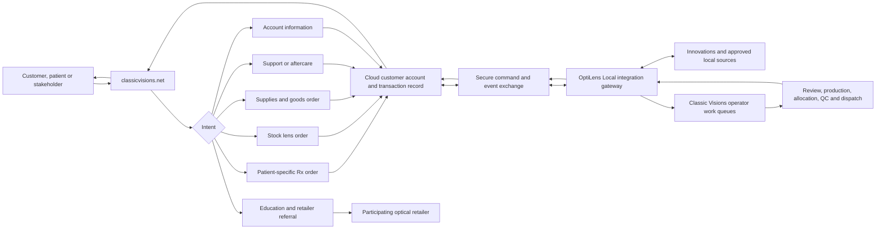

# Classic Visions Customer-to-Operations Service Blueprint

Status: working architecture baseline  
Owner: Classic Visions  
Last updated: 2026-07-10

## Purpose

Classic Visions should operate as one continuous service: a customer starts on the website, Classic Visions receives an accurate request, operators turn that request into a physical or informational result, and the customer can see what is happening throughout the lifecycle.

The governing service promise is: **never leave a legitimate visitor at a dead end**. Every journey must conclude with a completed self-service outcome, a saved request with a clear next step, or a confirmed support handoff with a reference number.

## People and roles

| Actor | Needs | Boundaries |
|---|---|---|
| Optical professional customer | Trade prices, Rx ordering, stock ordering, supplies, account records, job status and support | Sees only their organization and assigned commercial terms |
| Customer staff member | Acts for the customer with role-based permissions | Permissions may differ for ordering, finance and administration |
| Patient or public visitor | Lens education, product comparisons and retailer referral | No trade pricing, clinical diagnosis or access to customer records |
| Classic Visions operator | Reviews requests, resolves exceptions, creates or advances physical work and communicates status | Uses an authenticated operational work queue |
| Classic Visions finance/support staff | Statements, invoices, balances, tickets, returns and customer communication | Sees only the functions required by role |
| System administrator | Catalogue, rules, integrations, access and audit | Privileged actions are logged and independently authorized |

## Customer entry journeys

| Intent | Website outcome | Operational outcome |
|---|---|---|
| Patient-specific Rx lenses | Validated Rx order or saved draft with customer price and honest turnaround information | Operator reviews exceptions, creates/links the Innovations job, produces, quality-checks and dispatches the lenses |
| Stock lenses for local cutting | Searchable stock-lens order with quantity, availability status and account price | Operator allocates or procures stock, picks, checks and dispatches it |
| Supplies, cleaners, towels, frames or accessories | Standard cart and order with account price, delivery choice and confirmation | Operator picks/procures, packs and dispatches the goods |
| Technical, order, account, warranty or remake support | Self-service answer or a support case with reference, ownership and expected response | Assigned staff investigates, communicates, resolves and records the outcome |
| Account self-service | Orders, drafts, prices, balance, statements, invoices, tickets, notices and documents | Customer-visible data is synchronized from approved operational sources |
| Patient education or retailer discovery | Plain-language guidance and a participating retailer referral | No operational order is created unless a retailer/customer begins an authorized transaction |

## Shared transaction lifecycle

Every order or service request should use a common lifecycle vocabulary even when the physical process differs:

1. `draft` — customer has started but not submitted.
2. `submitted` — immutable customer submission has been received.
3. `acknowledged` — Classic Visions has issued a reference and accepted custody of the request.
4. `needs_information` — a named question or exception is blocking progress.
5. `accepted` — commercial and technical review has passed.
6. `in_progress` — production, allocation, procurement or investigation is underway.
7. `quality_check` — physical or informational result is being verified.
8. `ready` — ready for collection or dispatch.
9. `dispatched` — carrier or delivery information is available where supplied.
10. `completed` — delivered or otherwise fulfilled.
11. `cancelled` — stopped with actor, reason and timestamp recorded.
12. `aftercare` — return, warranty, remake or follow-up is active.

Customer wording may be friendlier, but it must map to one of these controlled states. Expected completion and tracking appear only when an underlying source supplies them.

## End-to-end service flow

## System boundaries and ownership

| System | Owns | Must not do |
|---|---|---|
| Public website and customer portal | Identity, permissions, device preferences, carts, drafts, website submissions, support cases, customer-safe status views and communication history | Connect directly to the production PSQL/LAN database or invent prices, availability, job status or turnaround |
| Cloud service database | Durable website transactions, authorization, synchronized customer-safe projections, event history and correlation mappings | Become an uncontrolled duplicate of every Innovations table |
| OptiLens Local | On-premises integration gateway, source adapters, validation, command intake, event publication, reconciliation and operator-facing work queues | Expose the LAN database publicly or let public callers run arbitrary queries |
| Innovations | Operational source of truth for accepted lab jobs and the fields confirmed to exist in its schema | Receive unvalidated AI-authored data directly |
| Classic Visions operators | Exception decisions, production and fulfillment actions, customer communication and overrides | Work from untracked WhatsApp/email instructions without creating or updating the same transaction record |
| Ask Classic / AI | Explain approved records, guide users, compare returned options and invoke permission-scoped tools | Diagnose, invent records, change commercial facts or perform sensitive mutations without confirmation |

## Integration pattern

The preferred connection is an **outbound, queued synchronization pattern**:

1. The portal writes a validated request and an immutable submission snapshot to the cloud service database.
2. A command such as `rx_order.submitted`, `stock_order.submitted` or `support_case.created` enters a customer-scoped queue.
3. OptiLens Local retrieves commands through an outbound authenticated connection, validates them again and records receipt idempotently.
4. The request enters an operator queue. Automated creation in Innovations is allowed only after the required data contract and safeguards are proven.
5. OptiLens Local publishes normalized events such as `order.acknowledged`, `job.in_progress`, `job.needs_information`, `shipment.dispatched` and `case.resolved`.
6. The cloud database updates customer-safe projections and preserves the event history.
7. The website shows the new state, source and freshness time and optionally notifies the customer.
8. Reconciliation jobs detect missing, duplicated, stale or unmapped records without silently changing them.

This design works without exposing an inbound PSQL connection. If near-real-time exchange is required, use a trusted secure tunnel or message endpoint, but keep the same command/event contracts and authorization rules.

## Correlation envelope

Every interaction must carry identifiers that let staff and systems trace the same work without relying on a patient name:

| Identifier | Purpose |
|---|---|
| `interaction_id` | The originating website or assistant interaction |
| `organization_id` | Customer account boundary |
| `actor_user_id` | Person who performed the action |
| `website_request_id` | Canonical portal transaction or case |
| `customer_reference` | Customer PO or patient reference supplied by the customer |
| `innovations_job_id` | Innovations job/accession identifier once created or matched |
| `invoice_id` | Financial document identifier when available |
| `shipment_id` | Dispatch/tracking relationship when available |
| `support_case_id` | Support, remake, warranty or return relationship |
| `causation_id` and `correlation_id` | Connect commands, events and retries across systems |

Patient-identifying data must be minimized, encrypted where appropriate and excluded from logs, analytics and AI context unless explicitly required and authorized.

## Operator workbench

Operators need one prioritized queue rather than separate inboxes. Each work item should show:

- customer, request type, age and current state;
- validation and commercial exceptions;
- source record and correlation identifiers;
- customer messages and attachments;
- required next action, owner and due time;
- audit history and status events;
- safe actions to request information, accept, reject with reason, progress, dispatch or resolve;
- a customer-visible preview of the message/status before publication.

Phone, email and WhatsApp requests should be captured as work items in the same model so the website remains an accurate account history rather than a separate channel.

## Information the signed-in customer should receive

The command centre should progressively expose every approved fact Classic Visions knows about that customer:

- organization profile, users, permissions and delivery preferences;
- assigned prices and catalogue eligibility;
- website orders, Innovations-linked jobs and their normalized statuses;
- drafts, reorders and saved configurations;
- invoices, statements, statement lines and balances;
- shipments and tracking supplied by the source;
- support, remake, return and warranty cases;
- notices, requested information and communication history;
- source/freshness labels and a clear escalation action.

## Non-negotiable service rules

1. No legitimate journey ends at a generic contact page when a structured request can be captured.
2. Every submission receives an immediate reference and acknowledgement.
3. All prices, availability, eligibility and turnaround values come from controlled data.
4. Customer records are organization-scoped and enforced server-side.
5. Mutating actions are idempotent, audited and confirmed before execution.
6. The portal never claims an Innovations/LabLink order exists until an operational identifier is returned.
7. Exceptions stay visible to the customer and operator until resolved.
8. The same state/event model powers the portal, operators, email, WhatsApp and Ask Classic.

## Delivery workstreams

1. **Service catalogue and journey map** — confirm every request type, actor, outcome, exception and service-level expectation.
2. **Identity and authorization** — map website users to customer organizations and staff roles.
3. **Canonical transaction model** — define order, line, Rx, support case, shipment, document and status-event contracts.
4. **Innovations discovery** — verify actual tables/queries and stable identifiers for jobs, lenses, invoices, shipments and statuses.
5. **OptiLens Local gateway** — add command intake, outbox publication, retries, reconciliation and operational health reporting.
6. **Operator workbench** — create prioritized queues and controlled actions.
7. **Portal completion** — connect Rx, stock, supplies, support and account views to the canonical model.
8. **Assistant tools** — expose the same permission-scoped read/actions with confirmations and audit.
9. **Observability and governance** — freshness, failures, audit, data minimization, security review and service metrics.

## Current baseline and known gaps

Currently available customer-facing operational data is limited to customer contacts, balances, statements and statement lines. The first-release portal also has website orders, support tickets, pricing and Rx-draft foundations, but live Innovations jobs, lenses, invoices, shipments and normalized job-status events still require verified source discovery and integration.

Before automating any write into Innovations, first prove a read-only job feed, stable identifier mapping, reconciliation and operator review path.

## Planning and execution model

Keep this blueprint as the durable shared source. Use one planning conversation to refine business decisions, and create a separate implementation task for each delivery workstream. Each task must update this blueprint or a linked decision record when it changes an ownership boundary, state, identifier or customer promise.
